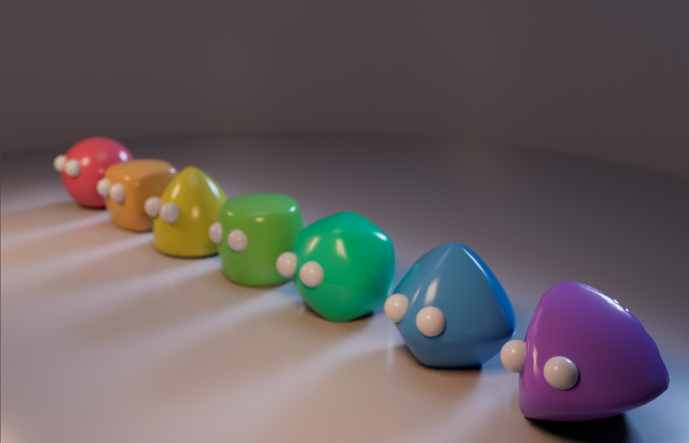

# CGGT
Cube Geometry Generating Tool (CGGT)

Based on the Paper "Cubic Stylization" from SIGGRAPH Asia 2019 by Hsueh-Ti Derek Liu and Alec Jacobson from the University of Toronto (https://www.dgp.toronto.edu/projects/cubic-stylization/)

Built for Maya 2022 with Visual Studio 2019

Dependencies: libigl, eigen, cimg, and maya api

NOTE: if you want to do resetting/local vs. global transforms, must change lines 21 and 23 in cubicstylization.cpp to correct file path. 
You must also change project properties (C/C++->General->Additional Include Directories) to include your igl include path and eigen include path.

To access within Maya, build the project in visual studio, and import the .mll generated in the plug-in menu. Then select a target mesh, select "Cubic Stylization", then "Offline Stylization" from the dropdown, change parameters, and click the "Deform" button.
